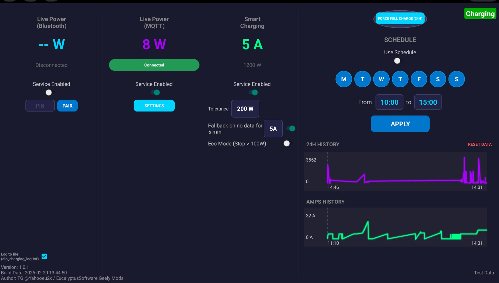

# DLB Charging

Intelligent charging controller for Geely EVs, optimizing charging sessions based on real-time household energy consumption.

## App Overview

This application functions as an intelligent charging controller for Geely EVs, designed to optimize charging sessions based on real-time household energy consumption and solar availability. It dynamically adjusts the charging current between 5A and 32A to utilize excess solar power.

Users retain full control with manual overrides like "Force Max Charge" for rapid top-ups, while a built-in safety fallback ensures consistent charging even if data connectivity is lost. The app retrieves data via MQTT protocols.

## Setup & MQTT Integration

A service like HiveMQ can be used for a free MQTT cluster. All you need to do is start sending your power consumption value there via a topic (e.g., "500" for 500 watts). You can retrieve that data from an energy monitor and then feed it there.

In my case, I'm using a BLE device Emerald Energy Advisor with a Python script that feeds data into MQTT. It's straightforward and any similar device can be used. For example, PowerPal Energy Monitor or CT clamps which can send data via Home Assistant to MQTT.

## Important Notes

* **Head Unit Boot Requirement:** The app works only when the head unit is booted up, which happens only when a scheduled charging session has been initiated.
* **Service Based:** It works as a service and launches automatically. No user action is needed once configured.
* **Data Efficiency:** MQTT is very data efficient so not much data would be used over the mobile network. Custom Profiles has an additional setting to keep Wi-Fi on when the screen is off, which will help with preserving mobile data.

